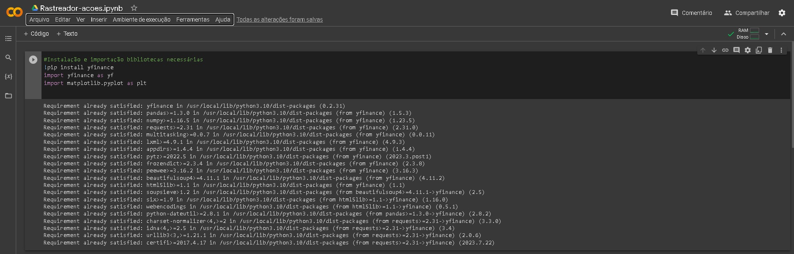
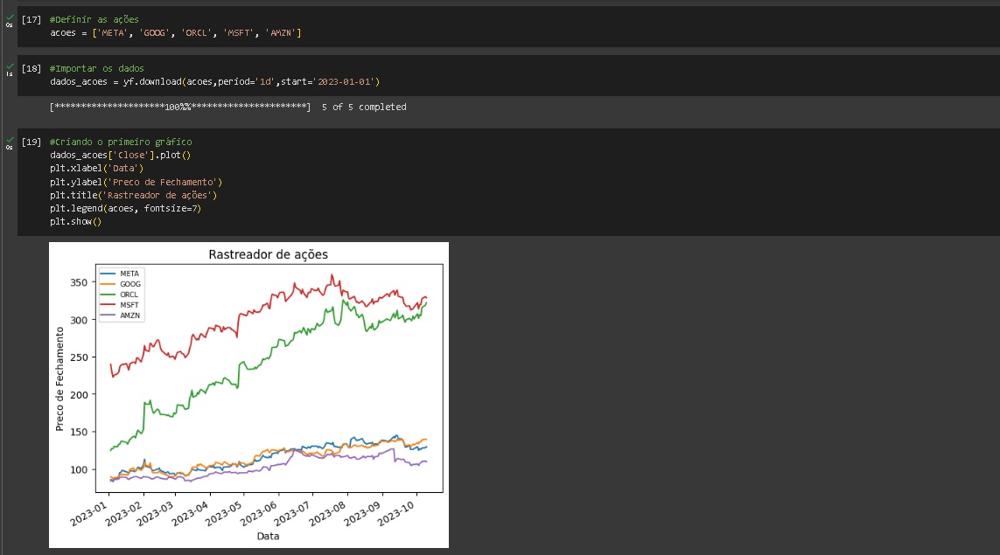
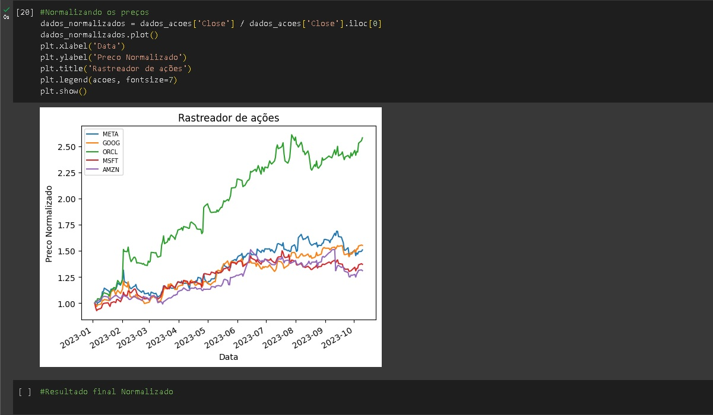

# rastreador-de-acoes-em-python
Rastreador de ações utilizando o Python

    
        
    

## 🚧 Bibliotecas Python

* yfinance;
* matplotlib;
* Matplotlib;

## 🛠 Tecnologias e Recursos Utilizados

* Python e as bibliotecas citadas;
* Google Colab;
* Github;
* Editor de código da sua preferência(no meu caso estou utilizando o VS Code);

## 🛠 Orientações Importantes

* O objetivo é criar de forma simples um rastreador de ações. 
* Gerar um gráfico com as informações coletadas.
* E para uma comparação mais precisa vamos normalizar as informações.

### Conteúdo 
Com o objetivo de aprendizado e  prática!

## 🚀 Let's code! 